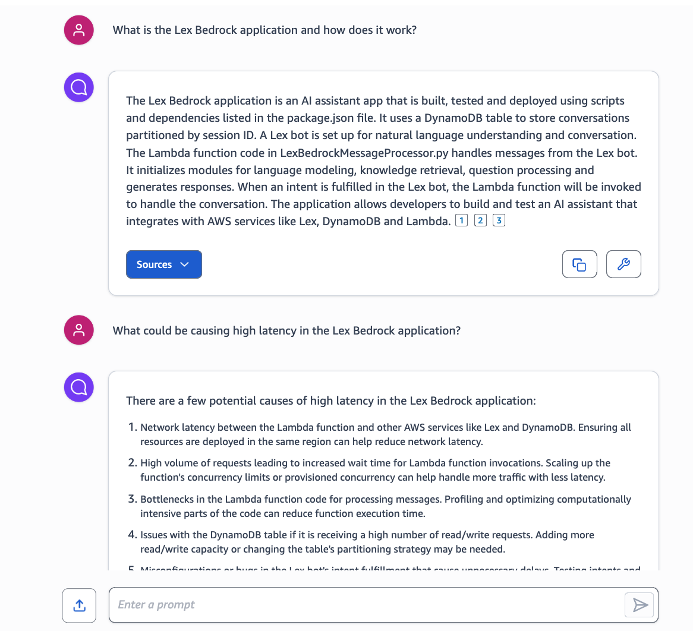

# Code Analyis using Amazon Q for Business

## Pre-requisites
[Configure your AWS Credentials](https://boto3.amazonaws.com/v1/documentation/api/latest/guide/credentials.html)

## Getting Started
Open the notebook, [Generate and Ingest Documentation](./Generate and Ingest Documentation.ipynb), and run the cells in order to generate the documentation for the sample repository and store them in the index.
If you want to change the repository, you can change the `repo_url` and `ssh_url` to specify the repository you want to analyze.
Then navigate to the Amazon Q for Business application and ask questions about the repository.

## Introduction
Amazon Q for Business is good at using connectors to index data and then allowing you to chat with that data using a managed RAG system. However, as anyone familiar with RAG will know, pulling the most semantically similar data is not always the best way to get the most relevant data. Particularly when dealing with chunks of code. This is where Amazon Q for Business without data pre-processing falls short.

To solve this problem, we take advantage of Amazon Q for Business's ability to return a response from an attached file with a question.

```python
def ask_question_with_attachment(prompt, filename):
    data=open(filename, 'rb')
    answer = amazon_q.chat_sync(
        applicationId=amazon_q_app_id,
        userId=amazon_q_user_id,
        userMessage=prompt,
        attachments=[
            {
                'data': data.read(),
                'name': filename
            },
        ],
    )
    return answer['systemMessage']
```

This is useful for code analysis as we can send a file to Amazon Q for Business and ask a question about it. This allows us to transform files into high-density data points using natural langauge.

## Code Analysis
To demonstrate the power of this function, we will use it to analyze a code file. We will use the following code file as an example:

```python
file_path = "./assets/sample.py"
prompt = "Come up with a list of questions and answers about the attached file. Keep answers dense with information. A good question for a database related file would be 'What is the data flow?' or for a file that executes devops commands 'How is the code being deployed?' or for a file that contains a list of API endpoints 'What are the API endpoints and what do they do?'"
answer = ask_question_with_attachment(prompt, file_path)
```

We will then take the response from Amazon Q for Business and ingest it into the Amazon Q application's index along with the filename and prompt. This will allow us to pull more relevant information from the index when we ask questions about the code.
```python
def upload_prompt_answer_and_file_name(filename, prompt, answer, repo_url):
    amazon_q.batch_put_document(
        applicationId=amazon_q_app_id,
        indexId=index_id,
        roleArn=role_arn,
        documents=[
            {
                'id': str(uuid.uuid4()),
                'contentType': 'PLAIN_TEXT',
                'title': filename,
                'content':{
                    'blob': f"{filename} | {prompt} | {answer}".encode('utf-8')
                },
                'attributes': [
                    {
                        'name': 'url',
                        'value': {
                            'stringValue': f"{repo_url}{filename}"
                        }
                    }
                ]
            },
        ]
    )
prompt = "Generate comprehensive documentation about the attached file. Make sure you include what dependencies and other files are being referenced as well as function names, class names, and what they do. Keep the answers dense with information."
answer = ask_question_with_attachment(prompt, file_path)
upload_prompt_answer_and_file_name(file_path, prompt, answer, repo_url)
```

## Analyze Entire Repository
To analyze an entire repository, we will use the following function to loop through all the files in the repository and upload the documentation to the Amazon Q application's index.
```python
def generate_documentation_for_repo(repo_url, repo_type, repo_name):
    repo = git.Repo.clone_from(repo_url, f"./{repo_name}")
    for root, dirs, files in os.walk(f"./{repo_name}"):
        for file in files:
            file_path = os.path.join(root, file)
            prompt = "Generate comprehensive documentation about the attached file. Make sure you include what dependencies and other files are being referenced as well as function names, class names, and what they do."
            answer = ask_question_with_attachment(prompt, file_path)
            upload_prompt_answer_and_file_name(file_path, prompt, answer, repo_url)
    shutil.rmtree(f"./{repo_name}")
```

We can then ask questions about the repository and get detailed answers:

```python
def ask_question_about_repo(prompt, repo_url):
    answer = amazon_q.chat_sync(
        applicationId=amazon_q_app_id,
        userId=amazon_q_user_id,
        userMessage=prompt
    )
    return answer['systemMessage']
```

You can also navigate directly to your Amazon Q for Business application, click on the live web experience, and start using that chat interface instead.

## Conclusion
Whereas Amazon Q for Business alone will not be able to answer complex questions like, 'What is causing high-latency in my application?' After we process all the files we are able to ask these questions. This in turn allows us to ask Q to generate detailed next steps to improve the codebase. This integrates nicely with Plugins for Amazon Q like JIRA, allowing us to rapidly find opportunities for improvement and immediately create tickets for them.

## Demo 
<!-- Image url -->
